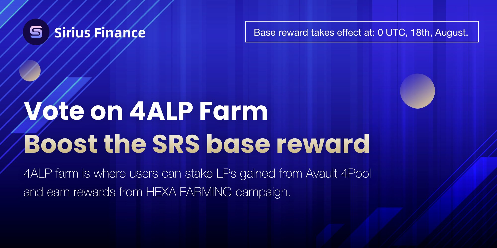

Sirius Finance 是 Astar Network 上第一个 Polkadot 原生稳定币 AMM。我们的使命是为稳定币提供一个稳定、高流动性的交易平台，为连接的协议提供深度流动性，吸引并锁定巨大的价值，以促进 Astar 和 Polkadot 的更多创新和合作。Sirius Finance 是第一个稳定币 AMM
Astar Network 上的基础设施，易于
每个人都开始他们在 Polkadot 上的旅程。以低滑点交换稳定币，
最小的无常损失 和可忽略的交易费用

