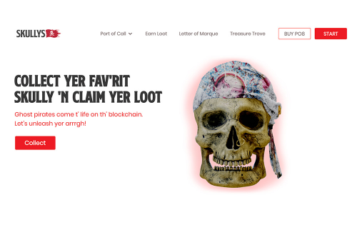

Skullys 是基于奖励的数字收藏品，在以太坊区块链上具有独特设计的幽灵海盗头骨。收集你最喜欢的骷髅并开始寻找战利品。我们的基于位置的服务 (LBS) 游戏允许玩家执行地理标记任务以获取 PO8 代币形式的战利品。 PO8 代币可以兑换额外的游戏配件来解锁新的能力，增加每个 Skully 的收入潜力。地理标记是一项功能，允许玩家使用来自移动设备或计算机的实时地理数据在餐厅、咖啡店、商店、音乐会或旅途中的任何地方等不同地点“签到”。玩家每天至少可以进行 3 次地理标志，并且每个标志标志必须出现在距离最新标志 800m 半径之外。 Skullys 的排名越高，在更广泛的地理区域内可获得的地理标记机会就越多。

