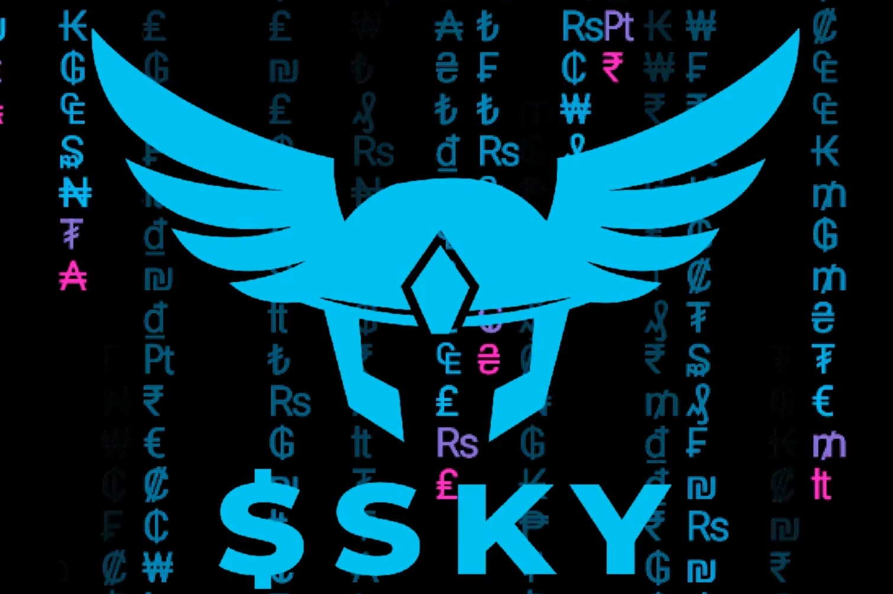

SKY Metaverse Token 用于空投 Twitter 关注者并允许他们交易 NFT。它激励参与 SKY Metaverse 社区，并通过网络效应鼓励增长。
通过 NFT 销售产生的收入用于通过公开市场回购 $SKY，以补充空投储备。
通过发送到空地址，铸造了 1 万亿，并烧毁了 7500 亿。因此，供应有限。

欢迎来到天空元宇宙。天空接线员待命。所有收入将用于从市场回购 $SKY 🚀SKY Metaverse Token 用於空投 Twitter 關注者並允許他們交易 NFT。它激勵參與 SKY Metaverse 社區，並通過網絡效應鼓勵增長。

通過 NFT 銷售產生的收入用於通過公開市場回購 $SKY，以補充空投儲備。

鑄造了 1 萬億，並通過發送到空地址而燒毀了 7500 億。因此，供應有限。

