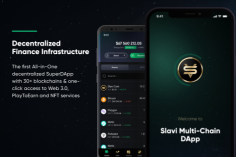

---
title: "Slavi Dapp"
description: "Slavi.io 是第一个跨链 DeFi 移动应用程序，集成了 30 多个区块链、NFT 市场、冷钱包、内置 DEX"
date: 2022-08-20T00:00:00+08:00
lastmod: 2022-08-20T00:00:00+08:00
draft: false
authors: ["boogArno"]
featuredImage: "slavi-dapp.png"
tags: ["DeFi","Slavi Dapp"]
categories: ["nfts"]
nfts: ["DeFi"]
blockchain: "BSC"
website: "https://slavi.io"
twitter: "https://twitter.com/slavi_io"
discord: "https://discord.gg/cJMYhXqRhD"
telegram: "https://t.me/SlaviDappGroup"
github: "https://github.com/slvlabs"
youtube: "https://www.youtube.com/channel/UC3ij75WKQ9GI-YdDa6XJN6g"
twitch: ""
facebook: ""
instagram: "https://www.instagram.com/slavi_io/"
reddit: ""
medium: "https://medium.com/@SlaviDapp"
steam: ""
gitbook: ""
googleplay: ""
appstore: ""
status: "Live"
weight: 
lightgallery: true
toc: true
pinned: false
recommend: false
recommend1: false
---
Slavi - 一体式超级 DApp 和平台，内置跨链和第 2 层解决方案。
新一代DeFi手机钱包，支持币安Smart Chain、Polkadot、Polygon（Matic）、Etherium、TRON、SOLANA、AVAX、NEAR、METIS、MINA等5000+加密货币和30+集成区块链。
Slavi DApp 还包括跨链去中心化交易所、NFT 市场、多链冷钱包、DeFi 赚钱工具和其他功能，用于最大化被动收入。第一个拥有 30 多个区块链的跨链去中心化 SuperDApp，一键访问 Web 3.0、PlayToEarn 和 NFT 服务。我们让持有者成为第一个体验拥有 SLV 代币的好处的人。
首先测试我们的第一个 DeFi 服务。

