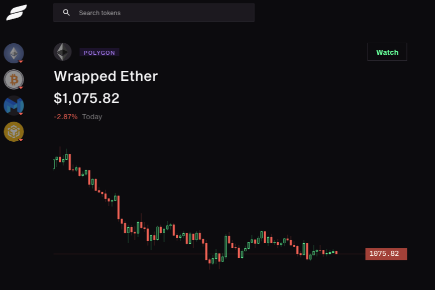

Slingshot 是一个交易平台，提供具有类似 CEX 的性能的聚合 DEX 流动性，具有最佳掉期率、实时图表和每种流动代币的交易数据，以及社交功能 - 全球聊天框、NFT pfps。连接您的支持 web3 的钱包并立即开始交易。Slingshot 就像一个搜索引擎。如果存在代币，我们会以最优惠的价格找到它。市场变化很快。在 Slingshot 上观看现场直播。混合搭配 139 多种独特的物品，超过 800,000 种组合。

