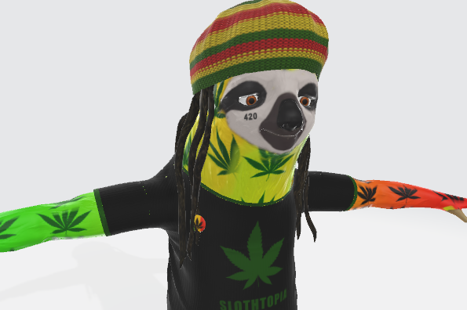

Slothtopia 是一个 3D 虚拟世界。推出 1000 个自定义头像，这些头像是游戏中可玩的角色。我们还发布了一个公寓/画廊功能，允许用户在 Metaverse 中拥有自己的空间并对其进行自定义。您可以将 NFT 挂在墙上、添加家具、将其变成单身公寓，或者将其变成您自己即将进行的 NFT 项目的展示。你想要实用？音乐视频中的这些树懒是真正的 NFT（你的在里面吗？）

在游戏中带上你钱包拥有的头像，看看它们看起来多么神奇

查看我们的 Discord，了解基于社区反馈的持续开发和部署。参与其中获取你的  头像

