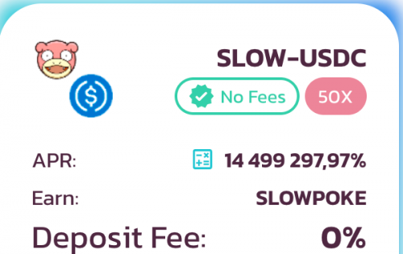

基于多边形网络的缓慢但肯定的 AMM。稳定的APY和稳定的代币，它从 37 级开始演变为慢速兄弟，或者在持有国王之石进行交易时演变为慢速王。

在 Galar，Slowpoke 具有纯粹的精神型区域形态，在 Pokémon Sword and Shield 的 1.1.0 补丁中引入。当暴露在 Galarica 手镯上时，它会演变成 Galarian Slowbro 或在暴露在 Galarica 花圈时会演变成 Galarian Slowking。，这些 Gen 1 Galarian 变体是在 Pokémon Go 的 A Very Slow Discovery 活动期间发布的，同时还有 Mega Slowbro - Slowbro 的 Mega Evolution。

由于在 2021 年万圣节活动期间发布，Galarian Slowking 现在可以在 Pokémon Go 中使用。

