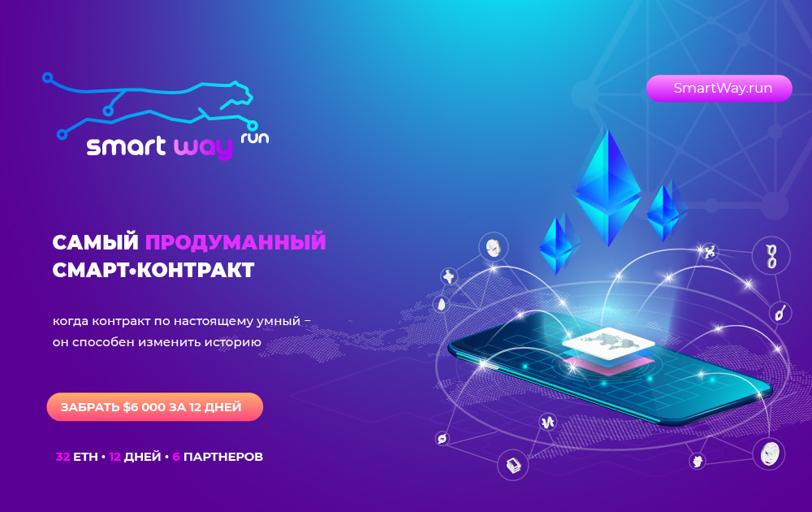

---
title: "SmartWay"
description: "最聪明的智能合约"
date: 2022-08-19T00:00:00+08:00
lastmod: 2022-08-19T00:00:00+08:00
draft: false
authors: ["boogArno"]
featuredImage: "smartway.png"
tags: ["High risk","SmartWay"]
categories: ["nfts"]
nfts: ["High risk"]
blockchain: "ETH"
website: "http://ww16.smartway.run/"
twitter: ""
discord: ""
telegram: "https://t.me/smartwayinfo"
github: ""
youtube: ""
twitch: ""
facebook: ""
instagram: ""
reddit: ""
medium: ""
steam: ""
gitbook: ""
googleplay: ""
appstore: ""
status: "Live"
weight: 
lightgallery: true
toc: true
pinned: false
recommend: false
recommend1: false
---
最智能的智能合约 当合约真的很智能时，它可以改变历史。 最现代的传销 - 快速赚钱系统 32 ETH • 30 天 • 6 个合作伙伴 • 输入 0.2 ETH：不是很多也不是很小，但足以排除那些没有准备好工作的人。 • 高收入：拥有 12 个等级，您可以毫不费力地将 0.2 eth 变成 32 eth。 • 共有 6 个合作伙伴：您的团队中的合作伙伴数量限制为两条线。 这是2 + 4人。 • REINVEST 30 天：不要害怕你没有时间通过所有级别，下次可以这样做，不会因为级别的舒适成本而感到利润损失

