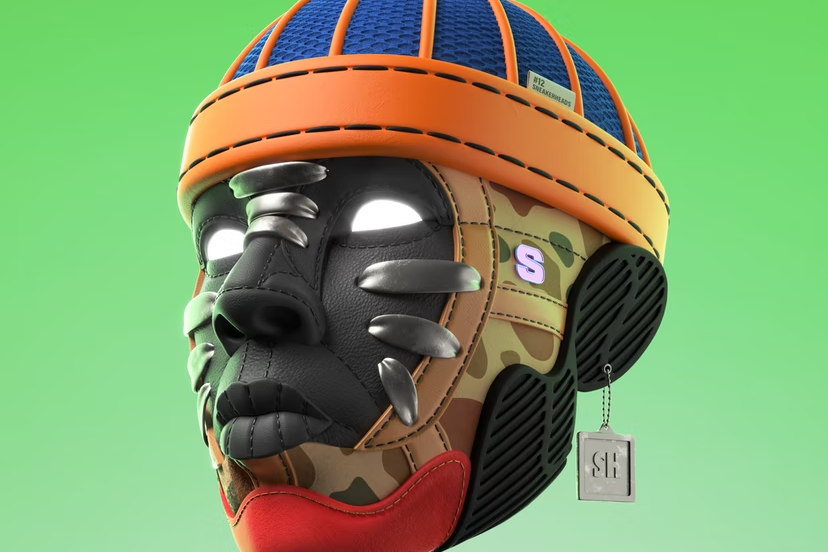

Sneakerheads 是由传奇艺术家和创始人 Ali Dawood 设计的 5000 个独特 NFT 的集合。超过 40 种精心设计的 3D 手绘基础模型具有无与伦比的细节水平 - 以前所未有的方式捕捉运动鞋的外观、感觉和风格。

Ali Dawood 制作的 5000 个手绘运动鞋头。将街头服饰文化带入 web3。

运动鞋头官方。 24 小时：3.09 -54.25%。地板：0.2450。供应：5000 个。ItemsAnalytics。筛选。实时视图。 328 个结果。在 22 小时内。价格：从低到高。这是一个基于社区和协作的基础设施的启动板，它将重新定义 Web3 中的街头文化世界。

