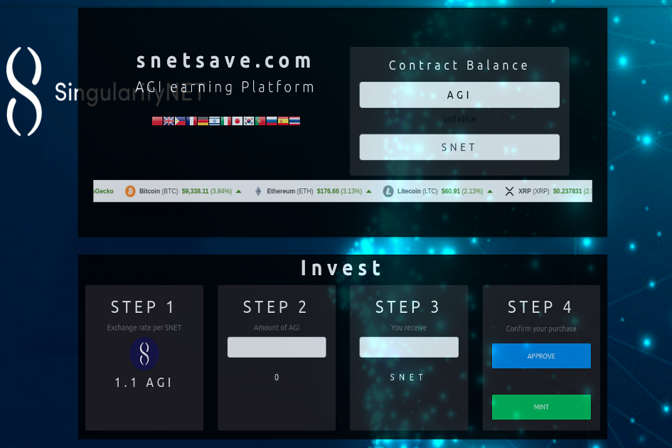

只需将它们放在我们的平台上即可赚取 AGI。购买 SNET 即刻赚取 AGI - 去中心化 - 安全使用 - 即时支付

SnetSave 是一个基于以太坊的 dApp。这是一个质押项目。您可以质押 AGI 代币，并随着时间的推移赚取更多。您也可以购买 SNET 代币。我不再与技术相关？我拥有数学博士学位。我曾在 NASA、洛克希德、西门子和 IBM 工作过。

netSave 是一个基于以太坊的 dApp。这是一个质押项目。您可以质押 AGI 代币，并随着时间的推移赚取更多。您也可以购买 SNET 代币。Snetsave 出厂默认配置。指定要从 SFTP 服务器加载到的配置文件。

