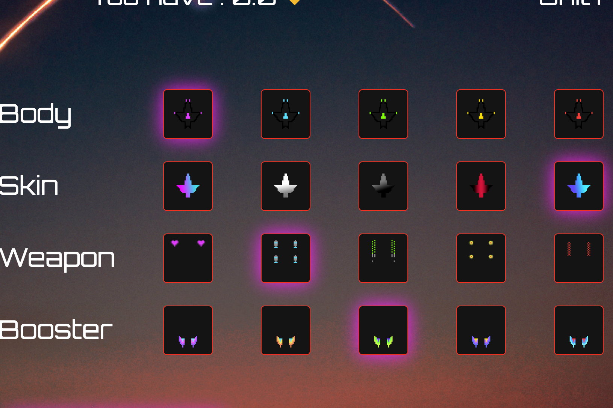

什么是太空矿工？力学
Space Miner 是一个多链 dApp，允许投资者铸造宇宙飞船以探索无尽的 DeFi 空间并获得被动收入。
宇宙飞船将无限期地探索太空，从行星上开采矿物，这些矿物既可以出售以获取利润，也可以用来制造更多的宇宙飞船。
宇宙飞船
太空飞船的一个非常独特的特点是它们采用永久技术建造，因此它们可以无限期地探索行星和开采矿物，从而为其持有者带来越来越多的收益。
宇宙飞船是卖不掉的，买了就永远属于你！用于铸造宇宙飞船的初始投资只能通过采矿和销售矿物获得！
机库大院
XMINE 可以每 12 小时复合一次，通过使用可用的矿物质在机库上沉积。每个复合增加 0.5% 的复合红利，总的复合红利适用于每日收益率。
复合红利最高为 5%。
出售矿物后，复合奖金重置为零 - 获利。
汽车复合
每个矿床都会自动复合所有可用的矿物质，但不会累加复合计数。
采矿许可证
太空船必须拥有有效的采矿许可证才能继续开采矿物。采矿许可证可以通过合同上的任何交易（例如买卖或复合）来更新。采矿许可证有效期为 48 小时。许可证过期的太空船不允许开采矿物！
反太空鲸
内置防御系统将防止太空鲸攻击您的船只并偷走您的矿物袋。
最初为每份合约设置了每次提款 1'000 美元的限额，这将防止鲸鱼操纵合约余额。
提款时超过 1,000 美元的任何盈余将自动在投资组合中复利。

