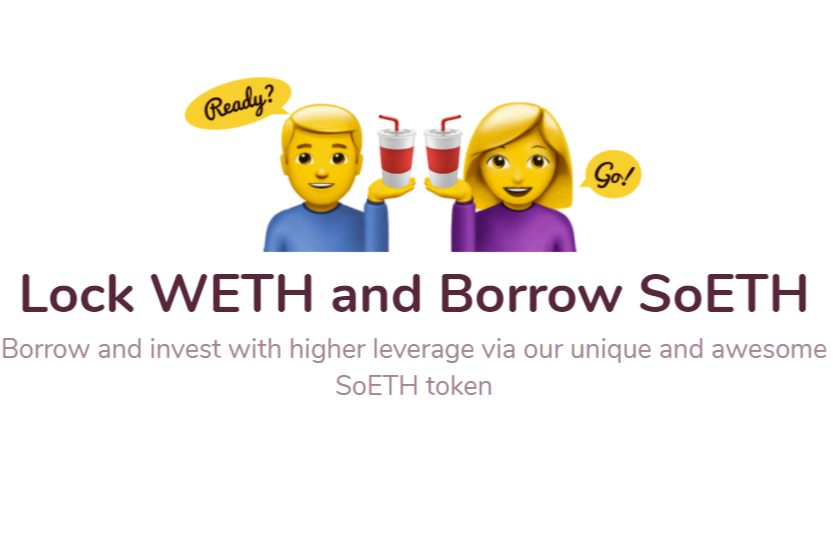

---
title: "Soda"
description: "获取一些苏打水以获得流动性！"
date: 2022-08-19T00:00:00+08:00
lastmod: 2022-08-19T00:00:00+08:00
draft: false
authors: ["boogArno"]
featuredImage: "soda.png"
tags: ["DeFi","Soda"]
categories: ["nfts"]
nfts: ["DeFi"]
blockchain: "ETH"
website: "https://soda.finance/"
twitter: "https://twitter.com/Soda_finance"
discord: "https://discord.com/invite/Tbzh8tF"
telegram: ""
github: "https://github.com/soda-finance"
youtube: ""
twitch: ""
facebook: ""
instagram: ""
reddit: ""
medium: "https://medium.com/soda-finance"
steam: ""
gitbook: ""
googleplay: ""
appstore: ""
status: "Live"
weight: 
lightgallery: true
toc: true
pinned: false
recommend: false
recommend1: false
---
无论您是寿司厨师还是完全错过了这艘船，都无需担心。无论哪种方式，你都会爱上苏打水！
SODA 是下一代 DeFi，它将把 Yield Farming 带到前所未有的高度！系好安全带，拿一根稻草——这会非常棒！
与其他项目不同，Soda 不仅仅是另一种农业代币——它是如此的“七月”和无聊。例如，使用 SODA，您可以通过我们独特而出色的 SoETH 代币以更高的杠杆借贷和投资，完成 DeFi 循环回到以太坊（拿那个 Sushi！）。琼斯苏打水由纯蔗糖制成。

