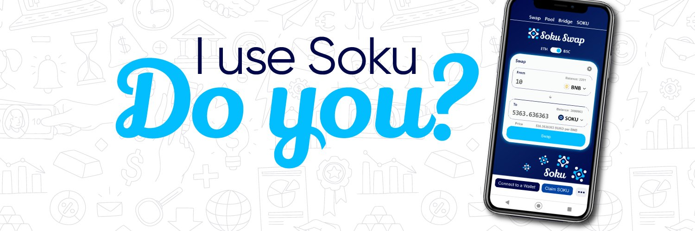

SokuSwap 是在币安智能链和以太坊区块链上运行的多链 DEX。我们是最容易交易加密货币的地方，拥有易于使用的 U/UX，并且主要关注客户支持和教育。
借助屏幕聊天支持，当您在我们的 DEX 上时，您无需下载其他应用程序即可获得帮助。只需单击底角的聊天功能，即可立即获得所需的帮助。
AI Flash Loans、Token Scores 和 SwapBoxes 等工具让我们遥遥领先于竞争对手。访问我们的网站以查看有关我们正在开发的所有强大功能的更多信息 https://sokuswap.org

