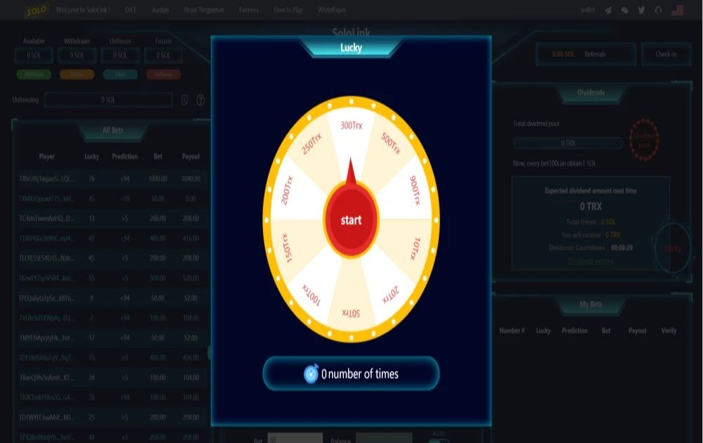

---
title: "SoloLink"
description: "SoloLink是基于Tron.network区块链建立的壹个去中心化、安全、可验证的分红型博"
date: 2022-08-19T00:00:00+08:00
lastmod: 2022-08-19T00:00:00+08:00
draft: false
authors: ["boogArno"]
featuredImage: "sololink.png"
tags: ["Gambling","SoloLink"]
categories: ["nfts"]
nfts: ["Gambling"]
blockchain: "TRON"
website: "https://sololink.pro/"
twitter: "https://twitter.com/SoloLink_1"
discord: ""
telegram: "https://t.me/SoloLink_EN"
github: ""
youtube: ""
twitch: ""
facebook: ""
instagram: ""
reddit: ""
medium: ""
steam: ""
gitbook: ""
googleplay: ""
appstore: ""
status: "Live"
weight: 
lightgallery: true
toc: true
pinned: false
recommend: false
recommend1: false
---

SoloLink 是基于 Tron.network 区块链创建的一个个去中心化、安全、可验证的分红型游戏平台。SoloLink 团队致力创建一个透明的、安全的、充满乐趣的游戏的游戏平台，无需担心平台的公正性和性、隐私及平台的安全性。阅读评论、比较用户评分、查看屏幕截图并进一步了解“SoloLink for Wifibooth”。下载 Wifibooth 的 SoloLink 并在您的...使用 SoloLink 将您的 iPhone 相机共享到您的 iPad：在您的 iPhone 上运行 SoloLink，在您的 iPad 上运行 Wifibooth。绿屏和手动等高级功能...SoloLink for Wifibooth 是 Solodigitalis 的实用程序应用程序。它在应用商店平均有 4 颗星，并且在其生命周期内被超过 5 人评价。

