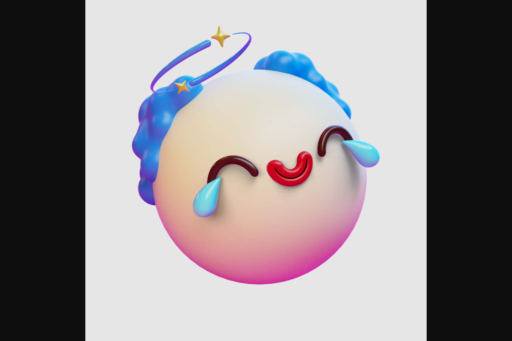

Moji 有时很可爱，有时很奇怪，但总有 10,000 个可玩的 3D 化身很有趣。 Moji 在 Sonar 中活跃起来，他们可以通过语音和文字结交朋友、表达表情并使用表情符号创造世界。预售白名单现已关闭。预售对那些从太平洋夏令时间 10 月 20 日下午 1 点到公开发售时间进行注册的人开放。Moji 在 Sonar 中活跃起来，在那里他们可以通过语音和文字结交朋友、表达表情并使用表情符号创造世界。访问 moji.sonar.app 了解更多信息。网站。声纳门极。 3,375 流通供应。 Moji 有时很可爱，有时很奇怪，但总有 10,000 个可玩的 3D 化身很有趣。

