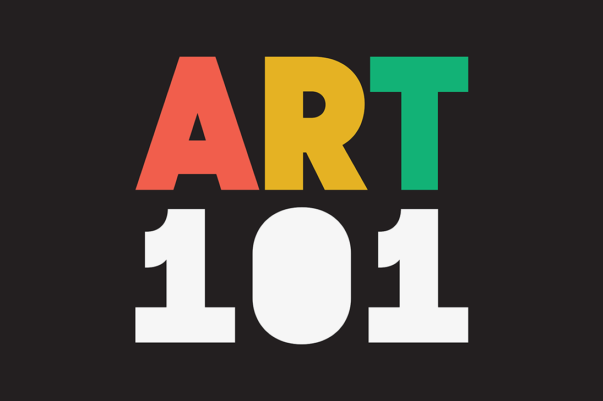

Non-Fungible Soup x MondrianNFT 是 20 世纪两位标志性艺术家 Piet Mondrian 和 Andy Warhol 的混搭。
Art101.io 为 Non-Fungible Soup 和 MondrianNFT 的白名单所有者提供的三个多版安迪·沃霍尔和皮特·蒙德里安矢量混搭的独家纪念配套下降。SoupxMondrian dapp-dapp.expert。苏普克斯蒙德里安。类别：区块链：语言：平台：Collectibles Ethereum English Web。收藏品·以太坊。SoupxMondrian dApp：SoupxMondrian 是 Andy Warhol 和 Piet Mondrian 的 NFT 集合。它结合了两个 NFT 集合：Non-Fungible Soup 和 MondrianNFT。

