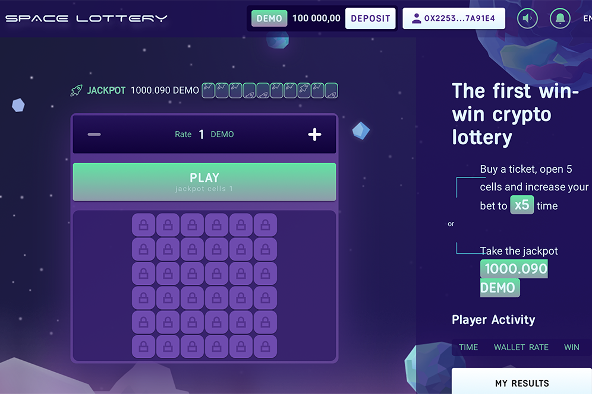

买一张票，打开 5 个格子，将您的赌注增加到 x5 次什么是太空彩票 TRX？购买一张票，打开 5 个单元格并将您的赌注增加到 x5 倍。你觉得这个页面怎么样？步伐彩票TRX竞猜,太空彩票TRX百科介绍,592btc在全球Dapp上探索NFT、NFT市场、区块链游戏、De-Fi、区块链上的Dapp。1 Space Token = 0.264573 TRON (TRX) · Space Token 图标 Space Token。 0.0183579990246 USD · TRON 图标 TRON。 0.0693964 美元。Pinterest 精简版。节省设备空间。注册。探索·金融。创联 |专业的 USDT-Tron (TRX) 钱包今天赚钱，方法。哈希彩票：TRX. ...彩票，cǎi piào，彩票...刚刚过去；发送;去除;摆脱；减少;在空间或时间上远离； ...

