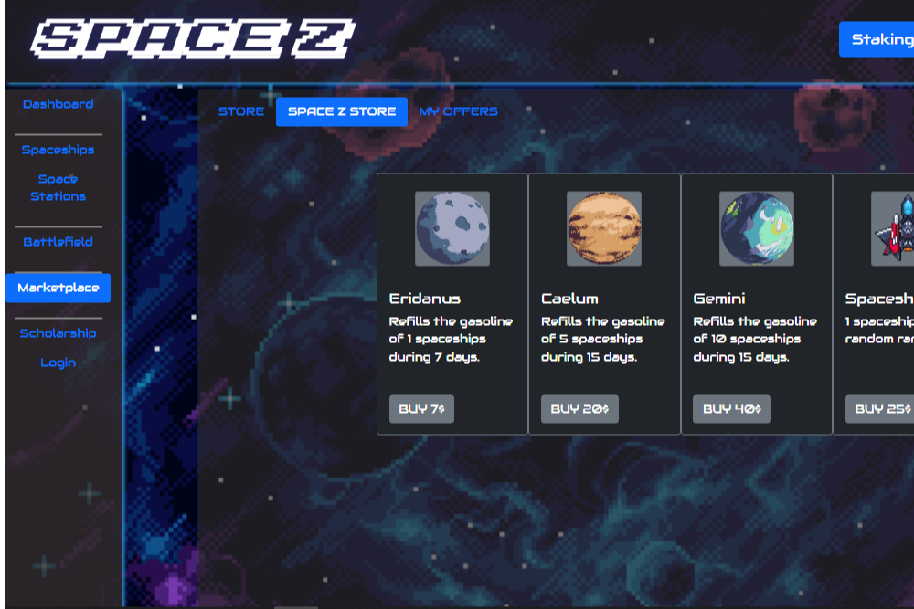

Space Z 是一款宇宙飞船对战游戏，攻击行星以获得奖励。
我们有一个神谕来维持经济平衡，有一个奖学金制度，为那些希望有机会进入没有经济能力的人的人提供奖学金，我们也有赌注以获得更多收入。
让你的宇宙飞船和空间站玩！
我们有许多可收藏的宇宙飞船，其中一些只能在活动中获得！
进入我们的 Discord 参加比赛，我们在等你。Space Z 是一款 Play to Earn 游戏，专注于收集宇宙飞船进行交易和游戏。

