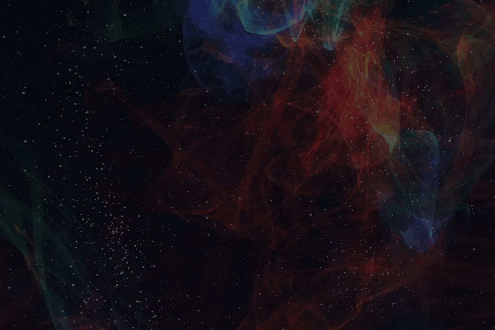

---
title: "SpaceMiner"
description: "🚀Space Miner 是 BSC 上的 Space 分叉。
⛽️加油，加油并赚取BNB。
💰8% 每天！ 13% 推荐奖金！
🌟反bot，公平发射！
👨‍💻6% 开发"
date: 2022-08-19T00:00:00+08:00
lastmod: 2022-08-19T00:00:00+08:00
draft: false
authors: ["boogArno"]
featuredImage: "spaceminer.png"
tags: ["High risk","SpaceMiner"]
categories: ["nfts"]
nfts: ["High risk"]
blockchain: "BSC"
website: "https://spaceminer.online/"
twitter: "https://twitter.com/SpaceMinerBSC"
discord: "https://discord.gg/yd572wkpe4"
telegram: ""
github: ""
youtube: ""
twitch: ""
facebook: ""
instagram: ""
reddit: ""
medium: ""
steam: ""
gitbook: ""
googleplay: ""
appstore: ""
status: "Live"
weight: 
lightgallery: true
toc: true
pinned: false
recommend: false
recommend1: false
---
什么是太空矿工？太空矿工特点
一个建立在 BSC 网络上的去中心化 BNB 矿工奖励池 dApp，以简单的方式为用户提供获得财务自由的机会。当您看到您的 BNB 代币每天都在增长时，尽情享受吧！
质押您的 BNB 并获得 8% 的每日回报，并将其再投资以赚取更多！每天高达 8% (2920%)
推荐人使用您的推荐链接从任何人那里赚取 13% 的 BNB 投资。
费用6% 开发者投资和提现费用，无再投资费用。欢迎来到最令人兴奋的空闲空间矿工 - 模拟器和大亨和管理游戏！您准备好管理自己的矿工并成为...

