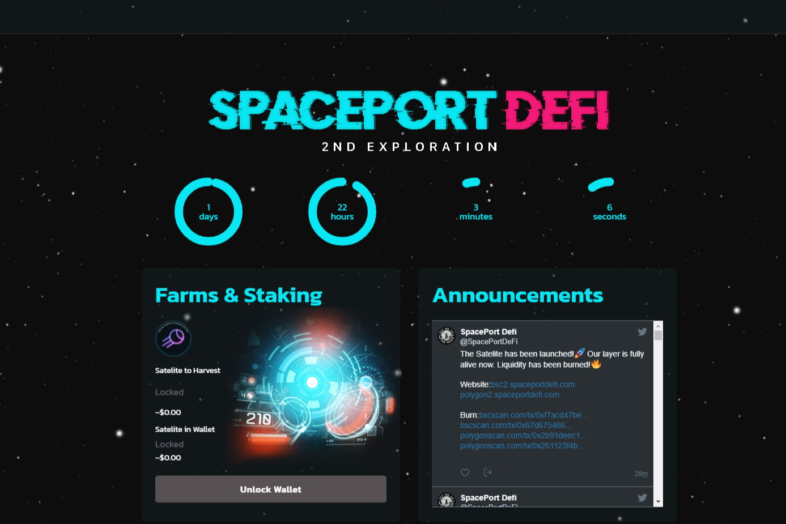

SpacePortDeFi 的第二次探索，你在 Polygon 和 BSC 上的跨链 DeFi 启动板。这一层为你提供了一个新鲜的代币、新鲜的农场，当然还有新鲜的四月。SpacePortDeFi Second Exploration 是一个发射台和一个收益农场。它由 BSC 网络提供支持。卫星是平台的原生代币。我们的第二次探索刚刚在 DappRadar 上市！ BSC 的耕作在 5 小时后开始，一定要进去吃一些多汁的 APR。我们的第二次探索将于周一开始。准备好！ ICO IDO IEO SpacePortDeFi 第二次探索。文章作者 由 www;发布日期 2022 年 7 月 6 日 · ICO IDO IEO SpacePortDeFi 第二次探索无评论...

