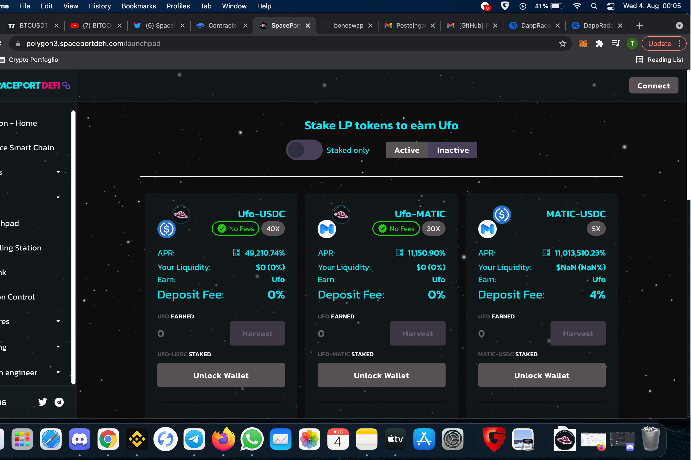

SpacePortDeFi“新视野”的第三次探索，您在 Polygon 和 BSC 上的跨链 DeFi 启动板。这一层为你提供了一个新鲜的代币、新鲜的农场，当然还有新鲜的四月。SpacePortDeFi Third Exploration dApp 是基于 Polygon 协议的 DeFi 类别的加密资产。现在它在一般 dApp 排名中排名为 #5509 ...我们第三次探索的不明飞行物令牌现已上线！过来看看。流动性已被烧毁。 https://polygon3.spaceportdefi.com 多边形：...@SpacePortDeFi。哪个农场开放？第三次探索？不明飞行物令牌？谢谢 ！下午 5:29·2021 年 8 月 5 日·iPhone 版 Twitter·SpacePort Defi·@SpacePortDeFi。
SpacePortDeFi Third Exploration的图片搜索结果

