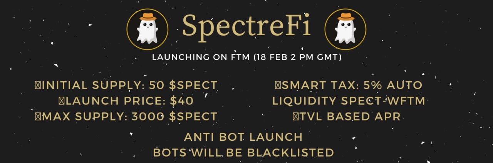

---
title: "SpectreFi"
description: "基于 TVL 的 APR 收益农场（含税）"
date: 2022-08-19T00:00:00+08:00
lastmod: 2022-08-19T00:00:00+08:00
draft: false
authors: ["boogArno"]
featuredImage: "spectrefi.png"
tags: ["DeFi","SpectreFi"]
categories: ["nfts"]
nfts: ["DeFi"]
blockchain: "Fantom"
website: "https://spectrefi.com/"
twitter: "https://twitter.com/SpectreDefi"
discord: ""
telegram: ""
github: ""
youtube: ""
twitch: ""
facebook: ""
instagram: ""
reddit: ""
medium: ""
steam: ""
gitbook: ""
googleplay: ""
appstore: ""
status: "Live"
weight: 
lightgallery: true
toc: true
pinned: false
recommend: false
recommend1: false
---
SpectreFi 提供了一个全新的基于 TVL 的 APR 功能，鼓励用户质押他们的代币。 TVL 越高，APR% 就会越高
来自 Assuredefi 的 KYC
反机器人功能（机器人将被列入交易黑名单）
细节：
🕐上市发布日期：格林威治标准时间 2 月 18 日下午 2 点
⏱Farming Launch（48 小时后）：格林威治标准时间 2 月 20 日下午 2 点
💎初始供应：50 $SPECT
💵发布价格：$40
💰最大供应量：3000 $SPECT
👻Dex：SpookySwap
💦智能税：5% 汽车流动性 SPECT-WFTM

