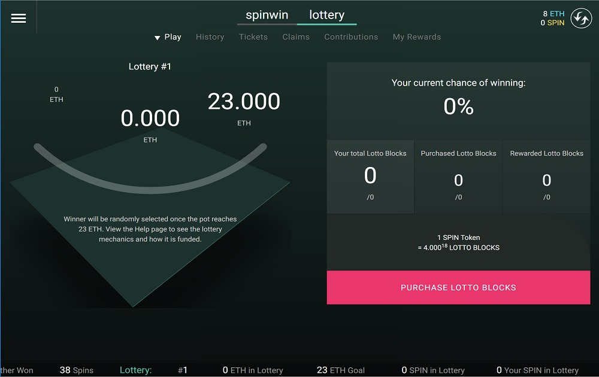

Spinwin 是以太坊区块链上一个完全自主的机会游戏，随着游戏条件的变化随着时间的推移而发展和进步。 Spinwin 没有获利的“房子”。取而代之的是，玩家在投注失败时获得 SPIN 代币，这使他们能够在游戏发展时在游戏中认领 ETH。我们与 Spinwin 的目标是构建一个基于区块链的游戏，该游戏不需要第三方的人工干预、维护或交互即可运行。它不依赖于 Oracle 或第 3 方 API。它可以完全在区块链上播放。

