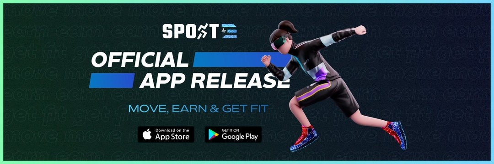

SportE 是一款运动健身应用，利用区块链技术为用户提供完整的体验，在虚拟环境中融合游戏和社交功能。
对于追求积极生活方式的下一代健身爱好者来说，这是一个创新的解决方案：注重健康、精通技术并在现实世界和虚拟世界中积极参与社交活动。

SPORTE - 2022 年胡志明区块链博览会银牌赞助商

首届越南元界活动将在 2022 年越南区块链博览会的舞台上举行，SportE 很荣幸成为胡志明市最大区块链活动的银牌赞助商。

