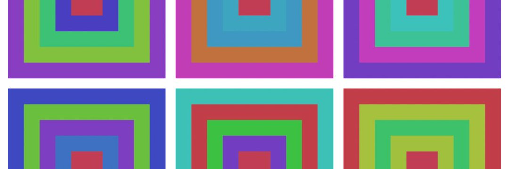

Squares on Chain 是一个 100% 在链上创建的 NFT 集合。 它是一个自包含的机制，每个 NFT 都是独一无二的。
Squares on Chain NFT 的铸币价格是动态的，每次智能合约上的铸币调用都会增加 1%。
铸币价格联合曲线是单调递增函数。
我们很高兴地宣布 Squares on Chain 现已上线 Polygon 网络！

Squares on Chain 是一个 100% 在链上创建的 NFT 集合。 它是一种创建 NFT 的新的自包含机制。

 Squares on Chain 现已上线 Polygon 网络！

http://squaresonchain.com

Squares on Chain 是一个 100% 在链上创建的 NFT 集合。它是一种创建 NFT 的新的自包含机制。

