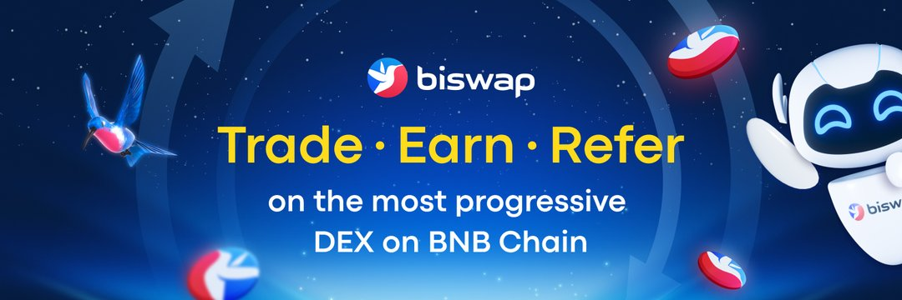

Squid NFT World 是一款由 Biswap 提供支持的 P2E 游戏，具有多种加密奖励。
游戏的关键区别点：

   多奖励池：未来用户将获得多种代币奖励：BSW、BNB等。
   推荐计划：推荐人有资格从每次推荐中获得终生 3% 的奖励。
   高 APR：玩主游戏并从高达 6000% 的 APR 中受益。
   员工游戏：有机会玩各种游戏，门槛低，回报高。
   大奖池（100,000 美元起）：NFT 游戏推出后不久。

Squid NFT World 是一款 P2E NFT 游戏，专为寻求愉悦游戏体验的用户需求量身定制。由 Biswap 提供支持的 Squid NFT World 将为每个玩家带来压倒性的钦佩和获得巨额加密收益的机会！
游戏部署在 BNB 链上。游戏的主要资产是 NFT Buses 和 NFT Players。他们给了参与比赛的机会。 Buses 和 Players 是使用 ERC-721 标准铸造的玩家拥有的 NFT。这些 NFT 既可以在 Biswap NFT 市场上交易，也可以像常规转账一样发送到另一个钱包。

