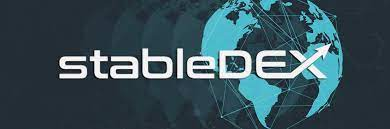

---
title: "stableDEX"
description: "由fineTOKE提供的stableDEX去中心化资产交易所"
date: 2022-08-19T00:00:00+08:00
lastmod: 2022-08-19T00:00:00+08:00
draft: false
authors: ["boogArno"]
authors: ["Metabd"]
featuredImage: "stabledex.png"
tags: ["Exchanges","stableDEX"]
categories: ["nfts"]
nfts: ["Exchanges"]
blockchain: "ETH"
website: "https://dappradar.com/"
twitter: "https://twitter.com/DEXstable"
discord: ""
telegram: "https://t.me/stabledex"
github: ""
youtube: ""
twitch: ""
facebook: ""
instagram: ""
reddit: ""
medium: ""
steam: ""
gitbook: ""
googleplay: ""
appstore: ""
status: "Live"
weight: 
lightgallery: true
toc: true
pinned: false
recommend: false
recommend1: false
---
由fineTOKEN提供的stableDEX去中心化资产交易所。 stableDEX 平台提供 100% 去中心化的点对点交易环境。 通过使用 stableDEX，用户可以完全保管和控制钱包内的资产。 交易者每笔交易支付 50 STDEX 的固定门票费用。 STDEX 是一种基于以太坊区块链技术的代币。 STDEX是我们为fineTOKEN OÜ提供的所有服务的平台币，包括investinTOKENS.com、stableDEX.io去中心化交易所、CoinMarketAlert.com和fineTOKENpay.com。 STDEX可用于支付费用，持有STDEX即可获得奖励。 FineToken OÜ 是 stabledex.io 网站上提供的服务的提供商。 FineToken OÜ 获得爱沙尼亚 FIU 的许可，可提供虚拟货币兑换法定货币的服务（许可证号 FVR000995）和提供虚拟货币钱包服务（许可证号 FRK000887）。

