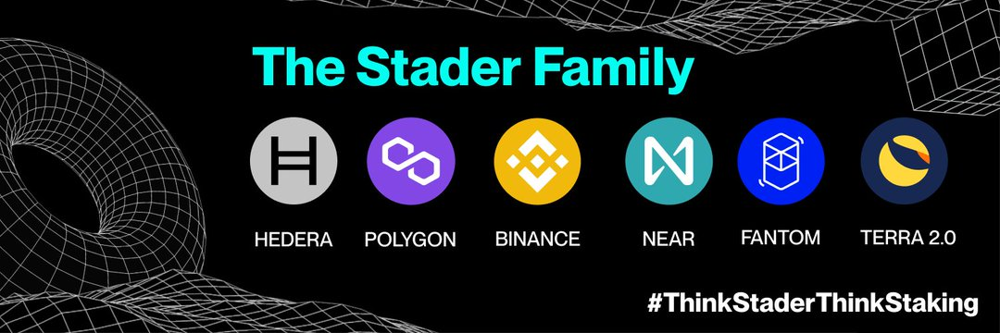

什么是斯塔德？
Stader 是一个基于非托管智能合约的 Staking 平台，可帮助您方便地发现和访问 Staking 解决方案。 我们正在为零售加密用户、交易所和托管人的多个 PoS 网络构建关键质押中间件基础设施。

⚡BNBx/BNB 矿池激励措施上线

💰将流动性添加到池中并持有 LP 以赚取 14% - 35% APR

💰在 Stader 上抵押 APY 约 34% 的基础上赚取这些收益！

使用 Stader 的权益池，您可以获得....

🚀 年利率 85%+

🔥 验证池的选择

🤩 摆脱 DeFi 大惊小怪

想和我们一起体验 Staking 吗？

