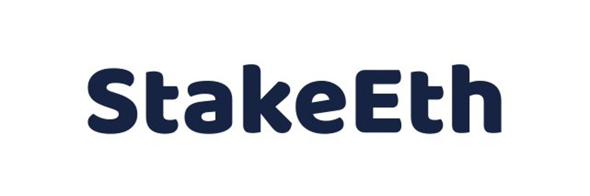

StakeEth 旨在为我们的投资者提供完全的灵活性。 通过多个质押期和首屈一指的推荐计划，您不会感到失望。
获得高达 4% 的推荐资产，并让自己获得对所有未来矿池的白名单访问权限！
我们的计划范围从 7 到 30 天，投资回报率各不相同 - 选择适合您的时间范围，不附加任何条件。

以太坊是对以太坊区块链的升级。 此次升级旨在提高以太坊网络的速度、效率和可扩展性，使其能够处理更多交易并缓解瓶颈。

