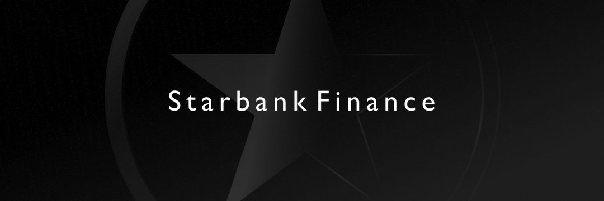

Starbank 是 Astar Network 的自动做市 (AMM) 去中心化交易所 (DEX)。
我们的使命是成为聪明投资者的 DeFi 投资之家。
我们已获准加入 Astar Builders Program。
https://forum.astar.network/t/starbank-builders-project-application/2829
Starbank 有几种类型的池，允许用户自动管理他们的投资组合，这对长期投资者有好处，因为有些池像指数基金一样工作。
加权池通过改变流动性池中资产的比率来帮助限制这种无常损失的风险。
稳定池基于 StableSwap（与 Curve 的逻辑相同），它允许在遇到重大价格影响之前进行显着更大的交易。 这些矿池将由 artbitrators 收取协议费用，一些矿池由我们的代币 SBX 激励。

