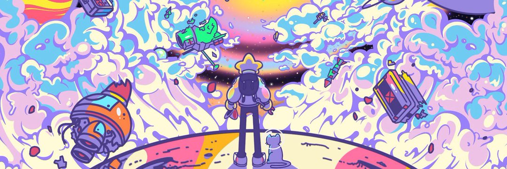

Starcatchers 是由 10,000 名有趣的明星组成的集合。 我们的社区驱动项目旨在开发一个代表我们社区价值观的品牌，并弥合 web3 和物理世界之间的差距。

BAP 力学
一旦您的 BAP 上线，您就可以使用它超越您当前的银河系，探索一个新世界。设备不稳定，单程票。打开门户会破坏（即烧毁）您的设备。
激活您的 BAP 将打开通往七个世界之一的门户。您前往的世界将取决于您激活的 BAP 类型（Void、Galactic、Focus、Grand、Gravity、A2EX-ULTRA 或 Giga Star's Blessing）。

