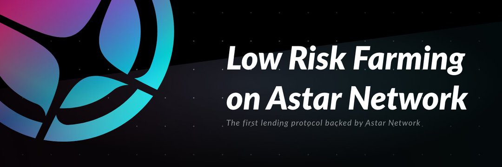

Starlay Finance 是一种借贷协议。 存款人可以提供流动性以赚取利息作为稳定的被动收入，而借款人可以在不出售资产的情况下利用其资产。
此外，借助魔凯功能，用户只需点击几下即可将奖励最大化 5 倍。

Starlay Finance 是一种让用户在 Astar Network 上快速轻松地存入和借入资产的协议。 存款人可以提供流动性以赚取利息作为稳定的被动收入，而借款人可以在不出售资产的情况下利用其资产。
借贷协议是 DeFi 可组合性的核心乐高积木之一。 它是一个公共的、去中心化的资产市场，不仅用户可以访问，机器人和其他 DeFi 协议也可以访问。 Starlay Finance 提供一整套贷款功能，重点关注在 Astar 上处理的资产。

