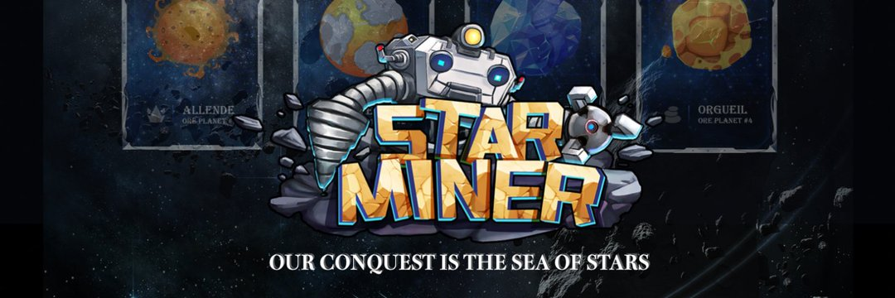

---
title: "StarMiner"
description: "玩赚取 NFT 挖矿游戏
轻松有趣地赚取！"
date: 2022-08-19T00:00:00+08:00
lastmod: 2022-08-19T00:00:00+08:00
draft: false
authors: ["boogArno"]
featuredImage: "starminer.png"
tags: ["NFT Games","StarMiner"]
categories: ["nfts"]
nfts: ["NFT Games"]
blockchain: "BSC"
website: "https://dappradar.com/"
twitter: "https://twitter.com/StarMiner_io"
discord: ""
telegram: ""
github: "https://github.com/StarMinerIO"
youtube: ""
twitch: ""
facebook: ""
instagram: ""
reddit: ""
medium: ""
steam: ""
gitbook: ""
googleplay: ""
appstore: ""
status: "Live"
weight: 
lightgallery: true
toc: true
pinned: false
recommend: false
recommend1: false
---
矿工，即 NFT，是从 Box 中诞生的。 玩家应在挖矿前使用 $ORE 代币购买盒子以赚取收益。 当一个盒子被打开时，一个独特的 StarMiner Character (SMC) NFT 被铸造出来。
有四个采矿星球可供矿工使用，它们是 Murchison、Allende、Peekskill 和 Orgueil。
这个空间充满了未知的风险，矿工的挖矿可能并不总是成功。 因此，有一定的盈利概率。 风险越大，挖矿成功概率越小，获得的收益越多，反之亦然。

