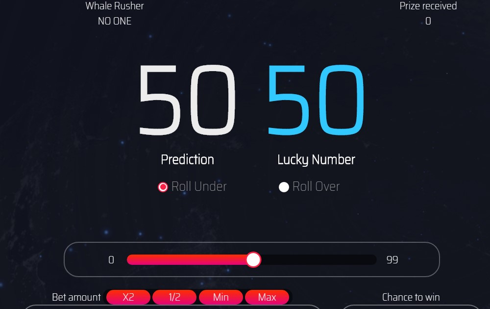

STARoll 是一个由波场智能合约运行的去中心化游戏应用程序（dapp）。 它引入了一种新的投资回报 (ROI) 分红模式，无论他们何时开始玩，都可以在几天内为玩家提供高达 150% 回报的高且可持续的被动收入。您必须年满 18 岁并居住在可以合法下注服务的国家/地区（如有疑问，您应寻求当地法律建议）。

STARoll 是一个去中心化的游戏应用程序， 您有责任确保您对服务的使用是合法的。 请负责任地赌博。

