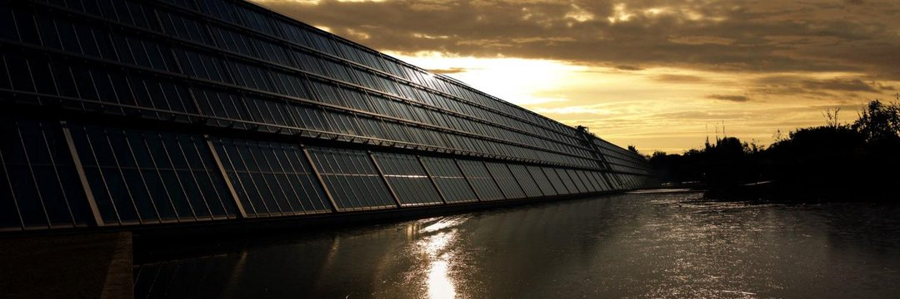

Start.solar 使您能够从全球各地的太阳能装置中生产清洁能源。 通过购买太阳能电池板股票，您将立即开始从发电中获利并帮助应对气候变化！ 所有权在以太坊区块链上进行跟踪，通过 market.start.solar dapp，每个人都可以轻松地购买、出售和转让股份。 发电产生的收入会自动分配给太阳能电池板股份的所有所有者。

我们呼吸的每一口空气，我们吃的每一口食物，都依赖于一个健康的自然世界”——大卫·阿滕伯勒爵士。
#ClimateChange 是我们这个时代的最终威胁。

