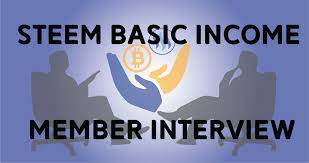

Steem Basic Income 是一项社会实验，旨在为尽可能多的 Steemians 带来基本收入。 成员通过赞助其他人加入该计划来加入。 Steem 基本收入通过定期对会员内容进行投票来提供。

注册的官方货币是STEEM（STEEM基本收入）。
{我们自行决定是否接受 SBD（通常在价格接近或 SBD 更强时），但您不会因使用 SBD 而不是 STEEM 支付而获得额外价值或任何部分退款。 如果我们选择接受 SBD 注册，我们将接受全部金额。 如果我们选择拒绝，我们将退还全部金额并要求您改为发送 STEEM。}

