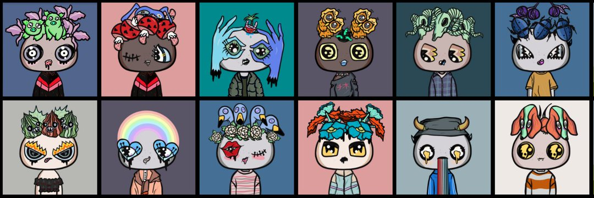

由艺术家/音乐家 Ahal Eden 和作家 Magi Otsri 创建的 7,777 名 Misfits 在以太坊区块链中漫游。 与Etoro合作。

格格不入的故事将被改编成一系列视听书（“A/V书”）。A/V 书籍是数字叙述的故事，伴随着音乐、动画和插图。

在每集发布之前，我们将抽出将在下一集展示的收藏品。

由 Ahal Eden 创作的音乐 NFT 的空投。

 Ahal Eden 的原声带（将在 Spotify 上播放）。

与知名和有前途的艺术家和音乐家合作。

