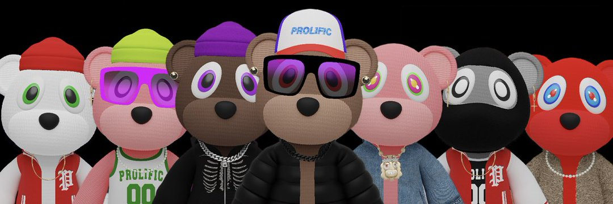

---
title: "Streetwear Bears Club"
description: "Metaverse 中的第一个街头服饰社区"
date: 2022-08-19T00:00:00+08:00
lastmod: 2022-08-19T00:00:00+08:00
draft: false
authors: ["boogArno"]
featuredImage: "streetwear-bears-club.png"
tags: ["Collectibles","Streetwear Bears Club"]
categories: ["nfts"]
nfts: ["Collectibles"]
blockchain: "ETH"
website: "https://dappradar.com/"
twitter: "https://twitter.com/StreetwearBears"
discord: "https://discord.com/invite/ugRTQ5VteN"
telegram: ""
github: ""
youtube: ""
twitch: ""
facebook: ""
instagram: ""
reddit: ""
medium: ""
steam: ""
gitbook: ""
googleplay: ""
appstore: ""
status: "Live"
weight: 
lightgallery: true
toc: true
pinned: false
recommend: false
recommend1: false
---
灵感来自我们对街头服饰和嘻哈文化的热爱。 十多年来，Prolific 在全球设计和销售了超过 100 万件服装，让年轻人的声音保持活力。
现在向名为“METAVERSE”的激动人心的新虚拟世界敞开大门。 Prolific 即将推出其第一个 NFT 系列。 “街头服饰熊俱乐部”收藏了 3,333 件独特的手工设计的 NFT 收藏品。
每个 NFT 都作为 ERC-721 令牌存储在以太坊区块链上，并托管在 Web3 上，确保文化在元宇宙中永远存在，同时建立一个将持续一生的社区。 每个 NFT 都会授予您我们专属俱乐部的会员资格。 会员将享受诸如访问弹出式商店、私人派对、NFT 画廊、多产的免费商品、现金奖励、赠品等福利。

