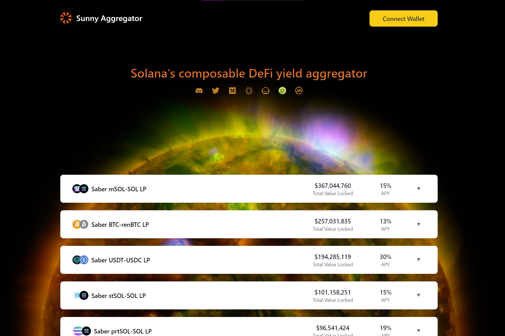

Sunny 是一个可组合的 DeFi 收益聚合器，由发展最快的区块链生态系统之一 Solana 提供支持。 Sunny Protocol 的设计以可组合性为核心功能，使其他应用程序和协议能够轻松地在其之上构建。Sunny 是由 Solana 提供支持的可组合 DeFi 收益聚合器。 Sunny Protocol 的设计以可组合性为核心功能，使其他...2022 年 8 月 16 日 - Sunny Aggregator 的当前价格为每 (SUNNY / USD) 0.000248 美元。 Sunny Aggregator 比历史高点 0.19 美元低 99.87%。Sunny 聚合器协议是由 Sunny Dao 管理的去中心化协议。 Sunny治理令牌（sunny）用于对未来做出决策...

