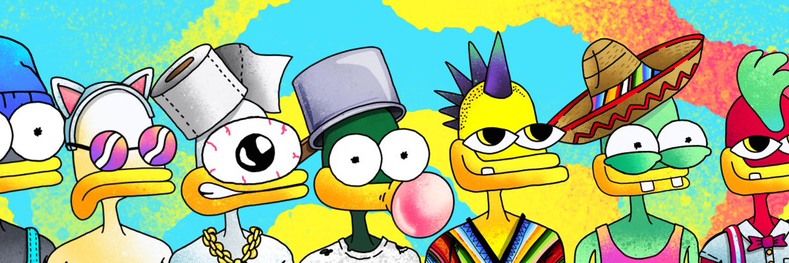

---
title: "SupDucks"
description: "只是躲着走。"
date: 2022-08-20T00:00:00+08:00
lastmod: 2022-08-20T00:00:00+08:00
draft: false
authors: ["boogArno"]
featuredImage: "supducks.png"
tags: ["Collectibles","SupDucks"]
categories: ["nfts"]
nfts: ["Collectibles"]
blockchain: "ETH"
website: "https://www.supducks.com/"
twitter: "https://twitter.com/RealSupDucks"
discord: "https://discord.com/invite/4bxdBNBy9g"
telegram: ""
github: ""
youtube: ""
twitch: ""
facebook: ""
instagram: ""
reddit: ""
medium: ""
steam: ""
gitbook: ""
googleplay: ""
appstore: ""
status: "Live"
weight: 
lightgallery: true
toc: true
pinned: false
recommend: false
recommend1: false
---
曾经想要 10,000 个朋友吗？好吧，您将要购买前往区块链上最病态俱乐部会所的单程票。 MegaVoltCorp 慷慨的霸主们煞费苦心地手绘了一些最糟糕的作品，我的意思是最糟糕的 MFin 艺术品，这样你就可以拥有一个你不会感到羞耻的头像。来吧，点击那个薄荷按钮，给自己一个漂亮的新 nft，但一次只有 10 个，你们这些贪婪的庸医！曾经想要 10000 个朋友吗？好吧，您将要购买前往区块链上最病态俱乐部会所的单程票。 MegaVoltCorp 的慷慨霸主...Sup Ducks 是以太坊区块链上 10,000 只独特的、随机生成的鸭子的集合。由 MegaVoltCorp 创建并由艺术家领导...

