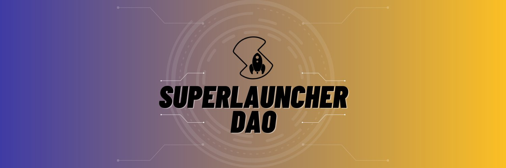

SuperLauncher 是一个跨链启动板，可让投资者以安全、可信和去中心化的方式访问优质项目，并使项目能够以一流的功能筹集资金。 SuperLauncher 帮助项目在币安智能链上进行代币销售、自动上币、流动性锁定和托管农场。很快将在 Avalanche 和 Cardano 上可用。SuperLauncher 是一个跨链启动板，它使项目能够以一流的功能筹集资金，并使投资者能够访问优质项目......现在使用#SuperLauncher V3，我们的代币具有更具影响力的功能。 LAUNCH 访问保证分配等继续获得 $EGG 投票..

