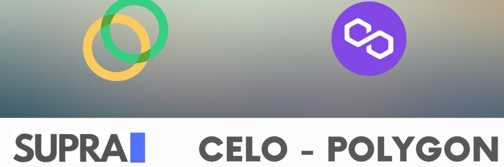

Supra Finance 是一个收益优化平台。专注于创新方法来最大化您在 DeFi 中的收益。我们根据正常和退化保险库的项目风险将我们的保险库分开。Supra 是#BSC、#FTM、#CELO 和#Polygon 的#Defi 的多链项目
使用我们的#SupraBridges 享受我们的保险库或在网络之间转移您的资金您的新代币在预定义且不断增长的范围内保持稳定。随着时间的推移，它的波动性降低，市场价格变得非常接近目标值。当前目标价为1.95美元，下限0.95美元，上限150美元。

$QTM 自推出以来价格几乎翻了一番😱

仍然不确定价格目标系统如何运作？我们已经有一篇文章解释了一切