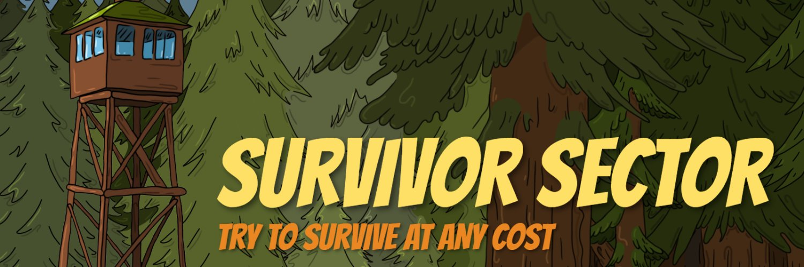

Survivor Sector - 是一个 Play-to-Earn WaxBlokchain 项目，但游戏本身是塔防类型的代表。在游戏过程中，玩家将成为营地的指挥官，营地由 5 座主要建筑组成：锯木厂、花园、车间、住宅楼和主要建筑——瞭望塔。为了补充营地的资源，

玩家将不得不派他的战士进行危险的探险。当然，派出最强大的角色来保护营地免受僵尸攻击。通过比较他们的力量、敏捷和智力分数，为每项活动单独选择合适的战士。赚取游戏内代币 - SWAX、SBM、SFOOD。

