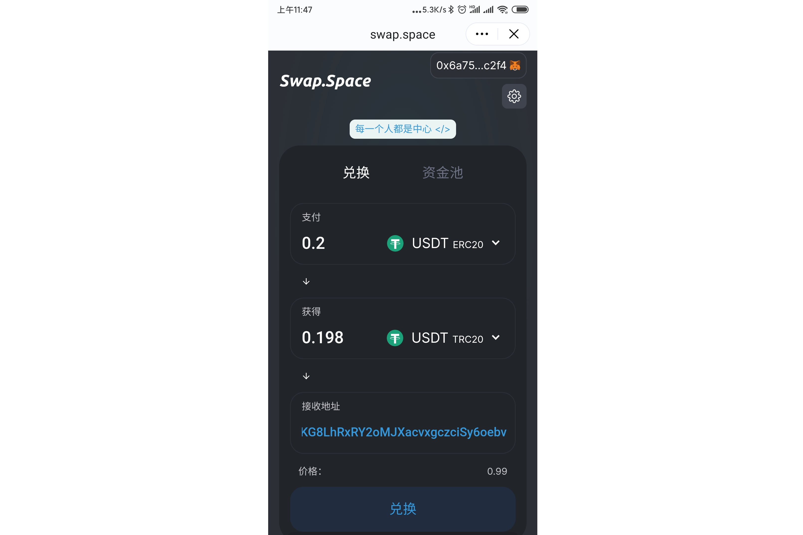

---
title: "Swap.Space"
description: "跨链稳定币兑换协议，同时提供流动性挖矿获得代币奖励。"
date: 2022-08-20T00:00:00+08:00
lastmod: 2022-08-20T00:00:00+08:00
draft: false
authors: ["boogArno"]
featuredImage: "swap-space.png"
tags: ["Exchanges","Swap.Space"]
categories: ["nfts"]
nfts: ["Exchanges"]
blockchain: "ETH"
website: "https://dappradar.com/"
twitter: "https://twitter.com/swapspace"
discord: ""
telegram: ""
github: ""
youtube: ""
twitch: ""
facebook: ""
instagram: ""
reddit: ""
medium: ""
steam: ""
gitbook: ""
googleplay: ""
appstore: ""
status: "Live"
weight: 
lightgallery: true
toc: true
pinned: false
recommend: false
recommend1: false
---
跨链稳定币兑换协议。 您可以将 ERC20-USDT 兑换成 TRC20-USDT，或将 TRC20-USDT 兑换成 ERC20-USDT。
当您在我们的池中添加流动性时，您可以获得平台代币奖励。 您可以兑换成 USDT，然后将其放入您自己的钱包地址。7 - 我们正在与之谈判以在我们的平台上持有他们的 IDO 和 INO 的项目数量。 并且有很多新的合作项目。你想要它 - 你得到它！ 😊对于所有没有参加 CrypCade IDO 的人，您将有另一个机会更接近 TGE。 🔥所有细节将在稍后通过我们的官方渠道公布。 👉加密货币春天来了！

