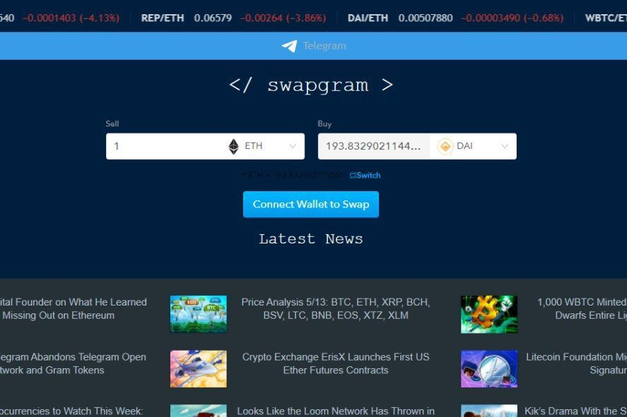

Swapgram 使用许多 Defi 和 ETH DEX API 为其用户提供最优惠的价格、低交易费用和许多支持者钱包。 Dapp 仍处于 alpha 版本！Swapgram是一种简单，快速且手续费低廉的ETH去中心化交易所。Swapgram上有许多ERC20代币，可为你的代币交易获得最优惠的价格！Swapgram 是一个 DEX。 它基于以太坊。 该平台使用各种 API。 这样做是为了向交易者提供最优惠的价格和低廉的交易费用。 Swapgram 没有 KYC。

