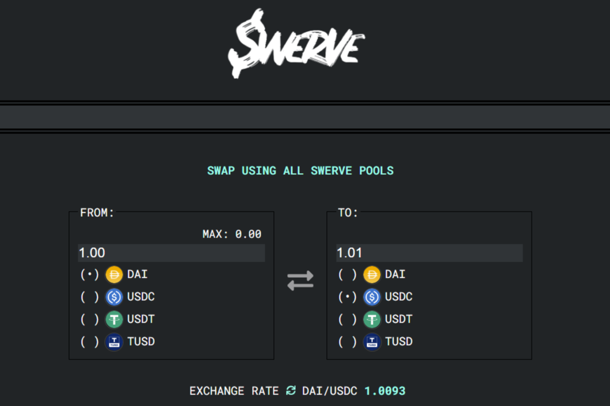

Curve Finance 的一个分支，100% 由社区拥有和管理。 Curve 是以太坊上的交易所流动性池（如 Uniswap），旨在 (1) 极其高效的稳定币交易 (2) 为流动性提供者提供低风险、补充费用收入，没有机会成本。Swerve Finance 是 Curve Finance 的一个分叉，后者是一个去中心化交易平台，已经累计锁仓量已超过 10 亿美元，并以其稳定币之间互换的低滑点而闻名。 Curve 的代币 CRV 推出的时间不长，但人们对它有些警惕，因为： 公司股东将获得 30% 的代币供应量

