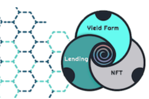

农场从区块开始：#22723000 on Polygon 预计目标日期：2021 年 12 月 19 日星期日 23:52:02
流动性 添加初始流动性 初始价格：50 美元 / SWIRL 0% SWIRL 相关池的存款费用。1.5% 其他池的存款费用。75% 的存款费用（1.5%）将分配给回购 SWIRL 并烧毁。 25% 的押金（1.5%）将作为广告和应急基金。 我们农场没有转让税

最高 2% 的存款费用
✅ 24 小时时间锁定背后的主厨
✅ 正确计算任何代币池的转让税
⚠️ 开发者地址可以设置为零地址，这将阻止定期提款和收获
额外 10% 的排放奖励被铸造到开发地址
初始流动性较低（100 美元），但被 RugDoc 流动性锁定服务锁定

