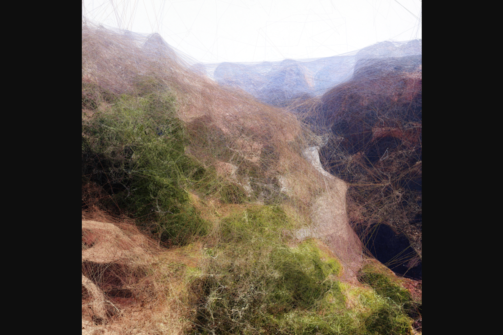

我们使用 Google Quantum AI 团队超越经典实验生成的量子比特串以及在 Quantum Memory 生产过程中开发的生成对抗网络机器学习算法，创建了独特的“Quantum AI 数据绘画”。
数据收集包括全球 2 亿张原始景观图像，包括美国的所有国家公园。
通过利用自定义程序相干噪声实现和超越计算 surflet 的经典测量，我们生成了 1000 幅受自然世界启发的独特量子 AI 数据绘画。 每幅画都是用唯一的量子比特串计算的！
这些图像融合了我们与感官体验相关的地球色素、形状和图案，同时向地球无限的诗意崇高致敬。

