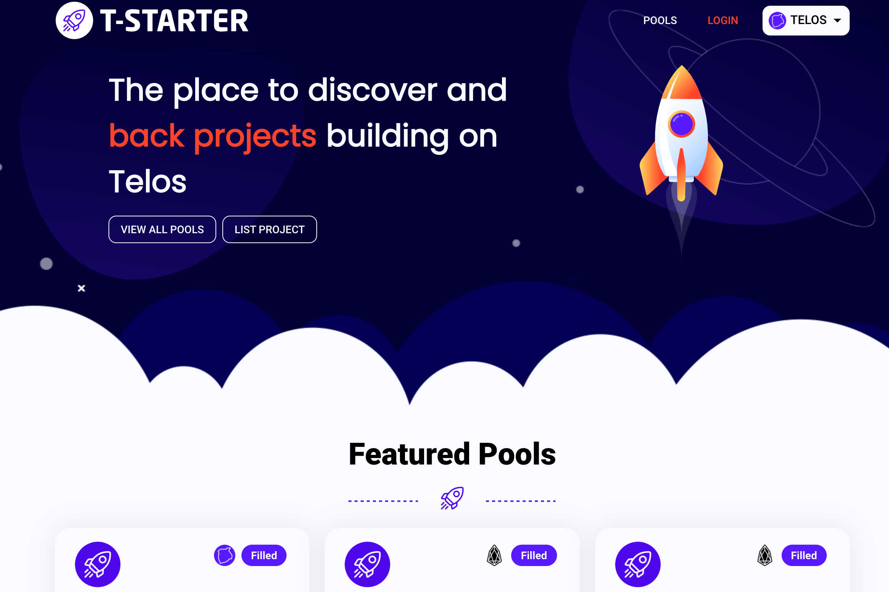

T-Starter 是一个跨链项目启动板，在 WAX、Telos 和 EOS 上运行。我们为项目提供固定比率互换池的自我上市，包括软上限、硬上限、账户白名单和代币归属。用户可以使用该平台来发现和支持他们希望看到启动的项目。 T-Starter 使用 START 实用性令牌。 START 代币使持有者能够获得质押奖励、销售期间的 VIP 特权以及治理问题的投票权。 START 是一种跨链代币，可以使用 T-Starter 跨链桥在 WAX、Telos 和 EOS 之间移动。

