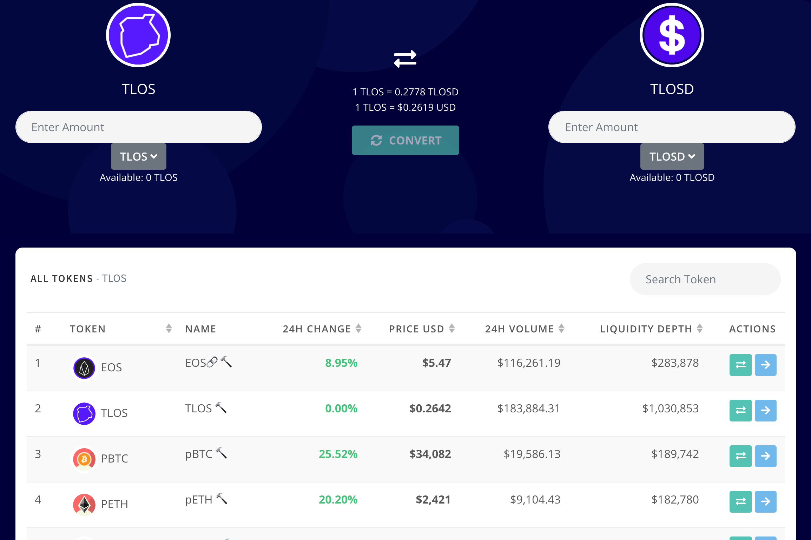

T-Swaps 的目标是成为 Telos 上流动性最高的 AMM 互换池。该平台支持打包的 BTC、ETH 和 EOS，以实现与其他区块链更好的互操作性。我们提供传统的掉期池以及低滑点的美元池。T-Swaps 是一个 AMM 交换池平台，允许简单地交换 Telos 代币。在总回报互换中，一方根据设定的利率进行支付，而另一方根据基础资产的回报进行支付。掉期是一种衍生合约，双方通过该合约交换金融工具，例如利率、商品或外汇。

